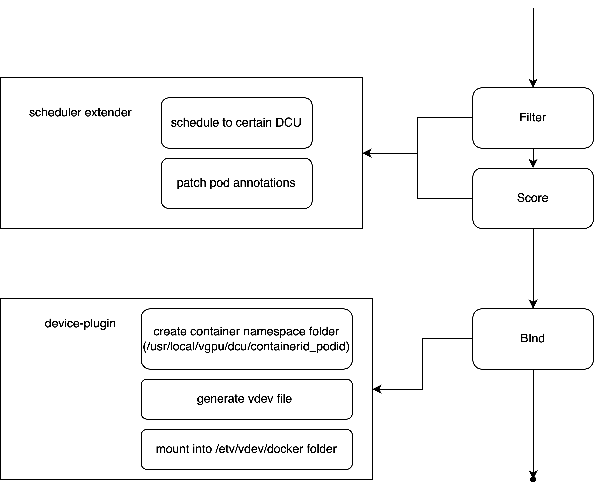

# DCU vGPU device plugin for HAMi

## Introduction
This is a [Kubernetes][k8s] [device plugin][dp] implementation that enables the registration of hygon DCU in a container cluster for compute workload.  With the approrpriate hardware and this plugin deployed in your Kubernetes cluster, you will be able to run jobs that require AMD DCU. It supports DCU-virtualzation by using hy-virtual provided by dtk

## Architect
The flow of vDCU job is as follows:


## Prerequisites
* dtk >= 24.04
* hy=smi == v1.6.0


## Limitations
* This plugin targets Kubernetes v1.18+.

## Deployment
```
$ kubectl apply -f k8s-dcu-rbac.yaml
$ kubectl apply -f k8s-dcu-plugin.yaml
```

## Build
```
docker build .
```

## Examples

```
apiVersion: v1
kind: Pod
metadata:
  name: alexnet-tf-gpu-pod-mem
  labels:
    purpose: demo-tf-amdgpu
spec:
  containers:
    - name: alexnet-tf-gpu-container
      image: ubuntu:20.04
      workingDir: /root
      command: ["sleep","infinity"]
      resources:
        limits:
          hygon.com/dcunum: 1 # requesting a GPU
          hygon.com/dcumem: 2000 # each dcu require 2000 MiB device memory
          hygon.com/dcucores: 15 # each dcu use 60% of total compute cores
```

## Validation

Inside container, use hy-virtual to validate

```
source /opt/hygondriver/env.sh
hy-virtual -show-device-info
```

There will be output like these:
```
Device 0:
	Actual Device: 0
	Compute units: 9
	Global memory: 2097152000 bytes
```

## Maintainer

limengxuan@4paradigm.com